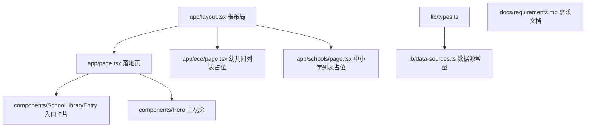

## 用户需求

构建一个新西兰游学信息查询网站，重点是学校库信息，便于用户按条件筛选。技术栈为 Next.js + Tailwind CSS + shadcn/ui，部署到 EdgeOne Makers。

## 产品概述

面向中国游学用户的中文信息门户，以新西兰教育机构官方开放数据（data.govt.nz，CC BY 4.0）为基础，提供幼儿园与中小学的可筛选学校库。界面以中文呈现，机构名称保留英文原文。本项目先从零搭建工程骨架，并输出一个聚焦「学校库入口」的 mock 落地页，后续逐步完善筛选列表、详情、数据管道等。

## 核心功能

- 项目脚手架：Next.js（App Router）+ TypeScript + Tailwind CSS + shadcn/ui，可直接 `npm run dev` 运行并部署至 EdgeOne Makers。
- 落地页（mock）：顶部导航 + 主视觉 Hero + 学校库入口模块（幼儿园 / 中小学两个分类入口卡片，点击进入筛选列表，列表页暂为占位）+ 页脚。
- 需求文档：项目内 `docs/requirements.md`，记录完整需求说明，并在后续每次交互中增量维护。
- 数据接入规划（本期仅搭骨架，不做全量拉取实现）：明确两个数据源资源 ID、全量 JSON 拉取端点与字段结构，为后续每日凌晨定时全量更新预留目录与类型定义位置。

## 技术栈选型

- 框架：Next.js 14+（App Router）+ TypeScript
- 样式：Tailwind CSS
- 组件库：shadcn/ui（基于 Radix UI + Tailwind）
- 包管理：npm
- 部署目标：EdgeOne Makers（支持 Next.js 静态/SSR 构建产物）

## 实现方案

### 总体策略

从零初始化一个 Next.js + Tailwind + shadcn/ui 工程，建立合理的目录分层（页面、组件、类型、数据层占位、文档）。落地页采用服务端组件渲染静态结构，学校库入口用客户端交互卡片（hover 动效 + 路由跳转占位）。数据接入部分本期只落地类型定义与常量配置，不实现定时任务，保证后续可平滑接入。

### 关键技术决策

1. **App Router 分层**：`app/` 下按路由拆分（首页 `/`、`/schools` 占位列表、`/ece` 占位列表），`components/` 放可复用 UI，`lib/` 放工具与类型，`data/` 放数据源常量与类型，`docs/` 放需求文档。符合 Next.js 官方约定，便于扩展。
2. **shadcn/ui 手动初始化**：不使用交互式 CLI（避免 plan 外执行），在方案中明确需创建 `components.json`、`lib/utils.ts`（cn 工具）及所需基础组件（Button、Card）。后续可用 `npx shadcn add` 增量补充。
3. **数据源类型先行**：在 `lib/types.ts` 与 `lib/data-sources.ts` 预定义 ECE 与 Schools 的字段接口与资源 ID 常量，为每日全量拉取（定时函数 / 构建期预取 / 路由缓存）预留清晰扩展点，本期不引入网络请求逻辑，避免无谓 I/O。
4. **中文为主、机构名保留英文**：UI 文案中文；学校/机构名称直接展示 API 原始 `Org_Name` 英文字段，不翻译。

### 性能与可靠性

- 落地页为静态可缓存页面，首屏无服务端数据请求，加载成本低。
- 后续全量拉取为每日一次低频操作，建议在 EdgeOne 定时函数或构建期执行，避免运行时高频请求政府 API。本期仅预留接口与常量，不实现，避免误触限流。
- 卡片交互使用 CSS hover 过渡，无额外 JS 重渲染开销。

## 实现注意事项

- 沿用 Next.js 官方目录约定，不引入额外状态管理库（本期无需）。
- 不改动系统配置之外的文件；保持 `package.json` 依赖最小化，仅引入运行所需（next、react、tailwind、shadcn 依赖、clsx、tailwind-merge、class-variance-authority、lucide-react）。
- 需求文档 `docs/requirements.md` 必须记录：项目目标、技术栈、数据源（两个资源 ID + 拉取端点 + 字段清单）、本期范围、后续待办，作为后续每次交互的单一事实来源。
- 所有 mock 数据使用本地常量，不请求外部网络。

## 架构设计

本期架构极简，采用 Next.js App Router 标准分层：

- 表现层：`app/page.tsx`（落地页）、`app/schools/page.tsx` 与 `app/ece/page.tsx`（占位列表）
- 组件层：`components/` 下的布局与入口卡片
- 数据/类型层：`lib/types.ts`、`lib/data-sources.ts`（数据源常量与接口，预留）
- 文档层：`docs/requirements.md`



## 目录结构

```
/Users/sun/Code/NZ网站/
├── package.json                 # [NEW] 工程依赖与脚本（dev/build/start），Next.js + Tailwind + shadcn 依赖
├── next.config.mjs              # [NEW] Next.js 配置，适配 EdgeOne 部署
├── tsconfig.json                # [NEW] TypeScript 配置，含路径别名 @/*
├── tailwind.config.ts           # [NEW] Tailwind 配置，启用 shadcn 设计令牌
├── postcss.config.mjs           # [NEW] PostCSS 配置（tailwind + autoprefixer）
├── components.json              # [NEW] shadcn/ui 配置（style/baseColor/cssVariables/aliases）
├── .gitignore                   # [NEW] 忽略 node_modules/.next 等
├── app/
│   ├── layout.tsx               # [NEW] 根布局：字体、全局样式、顶部导航与页脚
│   ├── globals.css              # [NEW] Tailwind 指令 + shadcn CSS 变量（主题色）
│   ├── page.tsx                 # [NEW] 落地页：Hero + 学校库入口模块 + 页脚
│   ├── ece/page.tsx             # [NEW] 幼儿园列表占位页（后续接入 ECE 数据）
│   └── schools/page.tsx         # [NEW] 中小学列表占位页（后续接入 Schools 数据）
├── components/
│   ├── ui/
│   │   ├── button.tsx           # [NEW] shadcn Button 基础组件
│   │   └── card.tsx             # [NEW] shadcn Card 基础组件
│   ├── site-header.tsx          # [NEW] 顶部导航栏（Logo + 导航链接 + 语言标识）
│   ├── site-footer.tsx          # [NEW] 页脚（版权与说明占位）
│   ├── hero.tsx                 # [NEW] 落地页主视觉区块
│   └── school-library-entry.tsx # [NEW] 学校库入口卡片（幼儿园/中小学，hover 动效 + 跳转）
├── lib/
│   ├── utils.ts                 # [NEW] cn() 工具（clsx + tailwind-merge）
│   ├── types.ts                 # [NEW] ECE / School 机构类型接口（基于数据源字段）
│   └── data-sources.ts          # [NEW] 两个资源 ID 与 JSON 拉取端点常量（预留接入）
└── docs/
    └── requirements.md          # [NEW] 需求文档：目标/技术栈/数据源/本期范围/后续待办
```

## 关键代码结构（可选）

```ts
// lib/data-sources.ts
export const DATA_SOURCES = {
  ece: {
    resourceId: "a9d65b07-8483-4b05-bdfd-d2abe4f38827",
    jsonUrl: "https://catalogue.data.govt.nz/datastore/dump/a9d65b07-8483-4b05-bdfd-d2abe4f38827?format=json",
    label: "幼儿园（早期儿童服务机构）",
  },
  schools: {
    resourceId: "4b292323-9fcc-41f8-814b-3c7b19cf14b3",
    jsonUrl: "https://catalogue.data.govt.nz/datastore/dump/4b292323-9fcc-41f8-814b-3c7b19cf14b3?format=json",
    label: "中小学",
  },
} as const;

// lib/types.ts
export interface InstitutionBase {
  id: string;
  orgName: string;        // Org_Name 原文
  orgType?: string;
  suburb?: string;
  city?: string;
  territorialAuthority?: string;
  regionalCouncil?: string;
  educationRegion?: string;
  latitude?: number;
  longitude?: number;
  total?: number;
  rollDate?: string;
}
```

## 设计风格

采用清新自然的新西兰风格（NZ Nature / 草原湖蓝）作为落地页视觉基调，结合现代 Glassmorphism 轻玻璃质感与流畅微动效。整体以中文界面呈现，机构名称保留英文原文。落地页聚焦「学校库入口」模块，包含 Hero 主视觉、幼儿园/中小学分类入口卡片（hover 抬升 + 渐变高亮）、页脚。设计需 premium 且响应式（桌面优先，移动端自适应堆叠）。

## 页面规划（落地页 + 两个占位列表页，共 3 屏）

### 落地页（/）

- 顶部导航栏：品牌 Logo「NZ 游学库」+ 导航（学校库/关于）+ 中/EN 标识占位，半透明毛玻璃吸顶。
- Hero 区块：大标题「探索新西兰优质教育机构」+ 副标题（面向中国游学家庭）+ 背景柔和渐变与微光动画，含一个示意搜索框（禁用态占位）。
- 学校库入口区块：两列卡片（幼儿园 / 中小学），各含图标、中英文标题、机构数量示意、进入按钮，hover 抬升与渐变描边。
- 页脚：版权与数据来源说明（data.govt.nz CC BY 4.0）占位。

### 幼儿园列表占位页（/ece）与 中小学列表占位页（/schools）

- 复用顶部导航与页脚。
- 占位标题 + 「数据接入中」提示卡片，预留筛选栏与列表栅格骨架。

## Agent Extensions

### Skill

- **ui-ux-pro-max**
- 用途：为落地页与占位列表页提供 UI/UX 设计智能与实现指引，确保视觉风格 premium、响应式与组件规范一致。
- 预期结果：产出符合新西兰自然风 + Glassmorphism 的落地页布局、配色与组件规格，并落地为可运行的 Next.js + Tailwind + shadcn 代码。