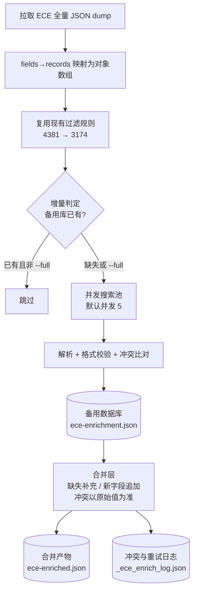

## 产品概述

新建一个**独立于现有逻辑**的 ECE（幼儿园）数据补全流水线脚本，用于补齐缺失字段并通过大模型联网搜索新增字段，产出备用数据库与合并后的新数据源。本次只走通流程，不改动 `src/scripts/fetch-data.mjs`，待验收后再谨慎合并。

## 核心功能

1. **拉取 ECE 全量数据**：从 data.govt.nz 拉全量原始记录，与现有 `fetch:data` 的拉取方式保持一致。
2. **过滤目标学校**：完全复用现有过滤规则，只保留当前线上会展示的 3174 所（与现有逻辑丢弃口径一致）。
3. **逐校联网搜索补全**：通过元宝大模型 API（搜索模式）搜集/校验以下信息：

- 校验类（原始已有则比对校验）：电话、邮箱
- 新增类（原始完全缺失）：官网、营业时间（如 `08:30-14:30`）、是否提供餐食、ECE 政策、假期模式（Term-time only / school holidays）

4. **形成备用数据库**：按学校 ID 索引存储搜索结果，附带来源、时间戳、置信度。
5. **合并产出新数据源**：缺失的补充进去、新增字段追加在后面；**原始值与搜索值冲突时以原始值为准，但冲突明细必须记入日志**。
6. **增量 / 全量模式**：默认增量（备用库已有则跳过），支持手动参数切换为全量重跑。
7. **先试点后全量**：先跑 20-50 所验证准确率与流程稳定性，验收通过后再全量。

## 技术栈

- **运行时**：Node.js ESM 脚本（`.mjs`），零新增依赖（内置 `fetch` / `fs/promises` / `path`），与项目现有 `src/scripts/fetch-data.mjs` 风格一致（纯 JS、中文注释、控制台日志）。
- **数据源**：data.govt.nz CKAN datastore dump（**JSON**，`a9d65b07-8483-4b05-bdfd-d2abe4f38827`）。
- **AI 接入**：CloudBase AI 网关，OpenAI Chat Completions 兼容协议（沿用 `generate-email/route.ts` 的 `Bearer ${CLOUDBASE_APIKEY}` + `chat/completions` 范式），元宝模型 + 搜索模式。
- **存储**：本地 JSON 文件（遵循项目"数据全部走本地 JSON"的既有约定）。

## 实现方案

**整体策略**：单文件多阶段脚本 `scripts/enrich-ece.mjs`，按 `拉取 → 过滤 → 增量判定 → 并发搜索 → 备用库 → 合并 → 产物` 顺序执行，CLI 参数控制各阶段行为。

**关键技术决策与权衡**：

1. **拉取格式选 JSON，不用 CSV**（用户让我判断）。理由：现有 `fetchSource` 的 `fields→records` 二维数组映射已验证可靠且零依赖；CSV 需额外解析库，而机构名/地址中逗号、引号、换行常见，转义反而易错；4381 条（原始约 5MB）体量下 CSV 的体积优势无意义。

2. **不 import `fetch-data.mjs`，改为在新脚本内复刻过滤逻辑**。因为 `fetch-data.mjs` 是带 `isDirectRun` 自执行的脚本，import 会触发 `main()` 联网重写数据。因此新脚本内独立实现约 40 行过滤代码（`KEEP_ECE_TYPE` / `KEEP_ECE_AUTHORITY` / `parseEceEqi` / 经纬度校验），并加注释标注"必须与 fetch-data.mjs 保持一致，合并阶段统一抽为共享模块"。

3. **AI 配置层全部走环境变量**（用户尚未提供元宝接入细节，这是硬阻塞）：`ECE_AI_BASE_URL` / `ECE_AI_MODEL` / `ECE_AI_API_KEY` / `ECE_AI_SEARCH_PARAM` 等，默认回落到项目已有的 CloudBase 网关配置。**第一步先做连通性冒烟验证**（拿 1 所学校试跑，打印原始返回），把参数未定的风险前置暴露，确认搜索模式生效、返回可解析后再往下走。

4. **解析层做容错双通道**：优先尝试 `response_format: {type:"json_object"}`；若网关不支持（参考现有 `parseAiEmailReply` 的容错做法），则退回"要求只输出 JSON + 从返回文本提取首个 JSON 块"的文本解析。

5. **冲突以原始值为准**：搜索结果写入 `FieldResult`，同时保留 `original` 与 `conflict` 标记；合并阶段 `original` 非空时一律采用原始值，冲突明细写入日志。

## 实现要点（防回归）

- **准确性**：prompt 必须携带 `name + street + suburb + city + 已知电话/邮箱` 提高定位精度（新西兰同名机构在不同 suburb 大量存在）；明确要求"找不到就返回 null，禁止编造"；机构名含毛利语长音符号（Māori、Takiwā）需原样传入。
- **结果校验**：对 URL、时间格式（`HH:MM-HH:MM`）、邮箱、电话做格式校验，非法则置 null 并标记 low confidence。
- **可靠性**：并发池（`ECE_ENRICH_CONCURRENCY`，默认 5）+ 单请求超时（60s）+ 指数退避重试（最多 3 次）；每处理若干所即时增量落盘，支持断点续跑；写文件用 `.tmp` + `rename` 原子替换，避免中断损坏 JSON。
- **日志**：必须记录冲突明细（学校 ID、字段名、原始值、搜索值）、失败重试、跳过统计。**不得打印 API Key**；模型原始返回仅在试点模式或失败时保留，避免日志膨胀。
- **性能估算**：3174 所 ÷ 并发 5 × 单所 5-15 秒 ≈ 1-1.6 小时；增量模式下仅新增学校才触发搜索，后续成本极低。
- **安全边界**：API Key 只从环境变量读取，绝不写入产物或日志；本次**不改动** `fetch-data.mjs` 与 `data/ece-frontend.json`。

## 架构设计



## 目录结构

```
项目根/
├── scripts/
│   └── enrich-ece.mjs          # [NEW] 主脚本：单文件多阶段流水线
│                               #   - 拉取：CKAN dump JSON + fields→records 映射
│                               #   - 过滤：复刻 KEEP_ECE_TYPE / KEEP_ECE_AUTHORITY / parseEceEqi / 经纬度校验
│                               #   - 搜索：prompt 组装、模型调用（搜索模式）、解析校验、并发池 + 重试
│                               #   - 存储：增量写入备用库（原子写、断点续跑）
│                               #   - 合并：缺失补充、新字段追加、冲突以原始为准、冲突日志
│                               #   - CLI：--limit / --full / --ids / --dry-run / --concurrency / --offline
├── data/
│   ├── ece-enrichment.json     # [NEW] 备用数据库：按 ECE_Id 索引的搜索结果 + 来源/时间戳/置信度
│   ├── ece-enriched.json       # [NEW] 合并产物：3174 所 + 补全/新增字段，作为后续步骤数据来源
│   └── _ece_enrich_log.json    # [NEW] 运行日志：冲突明细、失败重试、跳过统计
├── src/scripts/fetch-data.mjs  # [只读参考] 不改现有逻辑，仅作为过滤与映射的对齐蓝本
└── src/app/api/generate-email/route.ts  # [只读参考] 现有大模型调用范式
```

## 关键代码结构

```ts
// 备用库单条记录（data/ece-enrichment.json 的元素），多阶段共同依赖
interface EceEnrichmentRecord {
  eceId: string;                    // 与原始 ECE_Id 对齐，增量判定主键
  searchedAt: string;               // ISO 时间戳，用于判断是否需要刷新
  status: "ok" | "failed" | "skipped";
  fields: {
    phone: FieldResult<string>;     // 校验类：原始已有则比对
    email: FieldResult<string>;     // 校验类
    website: FieldResult<string>;   // 新增类，如 "https://..."
    openingHours: FieldResult<string>; // 新增类，如 "08:30-14:30"
    providesMeals: FieldResult<"yes" | "no" | "unknown">;
    ecePolicy: { provides20Hours: "yes" | "no" | "unknown"; summary: string };
    holidayMode: { mode: "Term-time only" | "Year-round" | "unknown"; summary: string };
  };
  source?: { url?: string; snippets?: string[] }; // 搜索命中来源，便于人工核对
  rawReply?: string;                // 模型原始返回，仅试点/失败时保留
}

interface FieldResult<T> {
  value: T | null;                  // 搜索得到的值
  original: T | null;               // 原始数据中的值，用于冲突比对
  conflict: boolean;                // 与原始值冲突时为 true（合并一律以 original 为准）
  confidence: "high" | "medium" | "low" | null;
}
```

## Agent Extensions

### MCP

- **CloudBase AI ToolKit**
- Purpose: 用 `searchKnowledgeBase` 查询 `ai_model` OpenAPI（AI 大模型接入 API）与 `ai-model-nodejs` skill 文档，确定元宝模型的**搜索/联网模式开关参数**、是否支持 `response_format: json_object`，以及 Node 端调用范式。
- Expected outcome: 拿到确切的请求参数与鉴权方式，可直接填入脚本的环境变量配置层，并通过 1 所学校的冒烟验证确认搜索模式真实生效。

### Skill

- **cloudbase**
- Purpose: 确认 CloudBase AI 在 Node 脚本侧的接入与鉴权范式（`CLOUDBASE_ENV_ID` / `CLOUDBASE_APIKEY`、网关 endpoint），与项目现有 `generate-email/route.ts` 保持一致。
- Expected outcome: 脚本 API 层与既有调用方式统一，凭证仅通过环境变量读取，不落盘、不进日志。