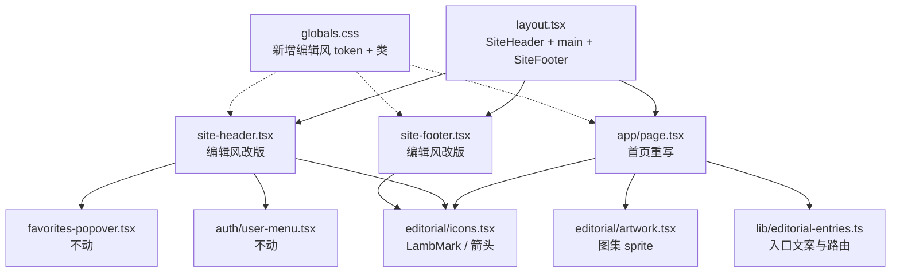

## 产品概述

把参考项目 `goalnz-next` 已定稿的首页设计完整复刻到 `NZ网站v2`,让首页从当前的"湖水蓝绿 + 无衬线"风格切换为"暖白纸色 + 墨绿 + 中文衬线"的编辑刊物风。

## 核心功能

- **首页主体重构**:立体书主视觉 Hero(眉标 / 大标题 / 描述 / 「出发吧」按钮)+「在出发之前,找到答案。」三入口目录(游学攻略 01 / 找学校 02 / 找住宿 03,各配插画与序号)+ 社群横条(小羊插画 +「成长这一页,我们一起翻开。」+「加入社群」按钮)。
- **全局导航与页脚改版**:顶部导航改为纸色底、小羊标志 + 衬线品牌字、细分隔线、方形线框图标按钮;页脚改为品牌简介 + 学校库 / 数据双栏 + 版权与公开数据底栏。
- **入口接真实页面**:攻略→`/guide`,找学校→`/schools`(中小学)+ `/ece`(幼儿园),找住宿→`/accommodation`,社群→`/community`;收藏与登录沿用站点现有 `FavoritesPopover` 与 `UserMenu`。
- **响应式**:沿用参考的三档断点(1300px / 1000px / 767px / 359px),手机端三入口转纵向卡片、导航换行、主视觉加宽出血。
- **不改动内页**:`/schools` `/ece` `/guide` `/accommodation` `/community` 等内页保持现有湖水蓝绿体系。

## 视觉效果

暖白纸底 `#f9f6f0` 上,墨绿文字 `#102e2c`、朱红序号 `#b44427`、灰绿细线 `#789491` 分隔;标题用中文衬线,品牌字用 Georgia 衬线;按钮为深墨绿渐变圆角块,悬停上浮;插画与纸色自然融合(正片叠底 / 边缘羽化)。

## 技术栈

沿用目标项目现有技术栈,不新增运行时依赖:

- Next.js 16.3.2 App Router + React 19 + TypeScript
- Tailwind CSS v4(`@tailwindcss/postcss`),通过 `@theme` 定义设计 token
- 图标:内联 SVG 自绘(小羊标志等)+ 现有 `lucide-react`
- 图片:`next/image`(`output: "standalone"`,非静态导出,可正常使用优化)

## 实现方案

**总体策略**:把参考项目的设计**原样移植**为一套并存的"编辑风"样式层,而不是替换现有湖水蓝绿体系。核心做法是**新增独立命名 token + 独立命名空间组件**,零侵入现有页面。

### 关键决策与权衡

1. **不覆盖 `--color-ink`**(最重要)。参考用 `--color-ink:#102e2c`,目标项目已被占用于 `#193a35`,全局覆盖会导致所有内页文字变色,超出本次范围。

- 做法:只新增 `--color-paper` / `--color-rule` / `--color-accent` / `--font-editorial` 四个新 token;参考 CSS 里少数用到 `var(--color-ink)` 的地方(`body` / `.site-footer` / `.footer-brand`)改为**硬编码 `#102e2c`**——参考原文本就在 `.brand`、`hero h1`、`.primary-button` 等处硬编码色值,风格一致。

2. **Header 保留 `fixed` 定位**。参考是文档流内静态 header,但目标项目 `layout.tsx` 的 `<main className="pt-16">` 依赖 fixed header,改为静态会把所有内页顶部间距搞乱。保留 `fixed`,仅替换视觉(纸色实底、去掉 backdrop-blur、小羊标志、衬线品牌字、下边框用 `--color-rule`)。差异仅在于滚动时是否吸顶,视觉几乎等价,风险最低。

3. **不移植「即将开放」dialog**。参考的 `.destination-dialog` 是为未配置地址的入口准备的;本项目所有入口都有真实页面,移植反而是死代码。同理不移植 `lib/site-config.ts` 的 `destinationLinks` 空配置机制,改为一个精简的入口配置常量。

4. **Hero 主视觉用 `next/image`**。参考用原生 ``;项目已有 `next/image` 使用习惯,改用 `next/image` + `priority` 可自动获得尺寸占位与懒加载优化,`` 的 `width/height` 属性语义等价保留。

5. **图集插画用 CSS sprite 窗口**。与参考一致:一张 `design-atlas.png`(1182×1331)通过 `background-position` / `background-size` 百分比定位四个区域,四个插画共用一次图片请求,不栅格化任何文字。

6. **字体不新增依赖**。使用系统中文衬线回退栈 `"Songti SC", "STSong", "SimSun", "Noto Serif CJK SC", serif`(用户已确认不安装 `@fontsource/noto-serif-sc`);品牌字 `Georgia, "Times New Roman", serif` 为系统自带,无网络请求。

### 性能与可靠性

- 主视觉 2087×754 单图,由 `next/image` 自动生成多尺寸与 WebP;`priority` 保证 LCP。
- 图集 1182×1331 单图复用 4 个插画,避免 4 次请求。
- 新增 CSS 约 190 行,与现有 574 行并存,`@theme` 新增 4 个变量不会触发全站重算(仅新增工具类)。
- 首页为客户端组件(`use client`),仅因「出发吧」按钮的 `scrollIntoView` 需要;逻辑极轻,无额外数据请求。

## 实现要点(防回归)

- **CSS 命名隔离**:新增类沿用参考原名(`.site-shell` `.page-width` `.hero` `.entry` `.community` `.site-footer` 等),需确认与现有 globals.css 无重名——现有类为 `.glass` `.chip` `.input` `.service-page` `.service-eyebrow` `.service-panel` `.guide-page` `.map-*` `.popup-*`,**无冲突**。
- **保留现有类**:`.service-page` / `.service-panel` / `.service-eyebrow` 仍被 `/accommodation`、`/community` 等内页使用,改写首页时不得从 globals.css 删除。
- **Header 结构复用**:保留 `FavoritesPopover`(含 `data-fav-trigger` 属性与数量角标)与 `UserMenu` 组件本体不动,只把触发按钮的 className 换成 `.icon-button`;内部图标保留 lucide `Heart` / `User`(尺寸由 `.icon-button svg { 24px }` 统一控制)。这样收藏/登录的跨页面状态与交互零回归。
- **`main` 的 `pt-16` 不动**,避免影响所有内页。
- **图集坐标必须原样**:`design-atlas.png` 直接文件复制,四个区域 `{notebook:98,836,215,140}` `{school:451,835,292,149}` `{keys:854,832,220,144}` `{lamb:22,1118,293,147}`,任何改动都会切错图。
- **`.hero-art` 负边距(-63px / 1300px+ 时 -70px / 767px 以下 +7px)是让主视觉与标题咬合的关键**,不要"顺手修正"。
- **`.entry-art .artwork` 的 mask 羽化**与 **`.community-art .artwork` 的 clip-path** 是为消除图集自带底色矩形与横线,属必要 hack,需连同注释一起保留。
- 完成后运行 `npm run build` 与 linter 校验,确认首页与内页编译通过。

## 架构设计

### 组件关系



### 数据流

首页无服务端数据:入口文案与路由来自 `lib/editorial-entries.ts` 常量 → 渲染三入口;点击跳转由 Next.js 路由完成(或锚点滚动)。Header 的收藏数 / 登录态仍由现有 `useFavorites()` / `useAuthUser()` 订阅,不受本次改动影响。

## 目录结构

```
NZ网站v2/
├── public/
│   ├── images/
│   │   ├── storybook.png            # [NEW] 从参考复制：立体书主视觉 2087×754，不透明象牙底 #FAF8F3
│   │   └── design-atlas.png         # [NEW] 从参考复制：插画图集 1182×1331，含 notebook/school/keys/lamb 四区
│   └── icon.svg                     # [NEW] 从参考复制：小羊 favicon（替换/新增站点图标）
├── src/
│   ├── app/
│   │   ├── globals.css              # [MODIFY] 在 @theme 中新增 --color-paper/--color-rule/--color-accent/--font-editorial
│   │   │                            #          四个 token（不动 --color-ink 等现有变量）；追加 ~190 行编辑风组件样式
│   │   │                            #          （.site-shell .page-width .site-header .brand .nav-link .icon-button .hero
│   │   │                            #            .primary-button .section-heading .entry-* .artwork* .community* .site-footer*
│   │   │                            #            .skip-link）及 1300/1000/767/359 四档断点与 prefers-reduced-motion。
│   │   │                            #          保留 .service-page/.service-panel/.chip/.input/.glass 等现有类不动。
│   │   ├── layout.tsx               # [MODIFY] metadata 同步为参考文案（标题「GoalNZ · 让好奇心，在新西兰长大」、
│   │   │                            #          描述「新西兰亲子游学信息服务…」），icons 指向 /icon.svg；结构不变
│   │   └── page.tsx                 # [MODIFY] 整体重写为：Hero（眉标/大标题/描述/出发吧按钮/立体书主视觉）
│   │                                #          + 三入口目录（01 游学攻略→/guide、02 找学校→/schools、03 找住宿→/accommodation）
│   │                                #          + 社群横条（小羊插画 + 加入社群→/community）。不再使用 .service-page。
│   ├── components/
│   │   ├── site-header.tsx          # [MODIFY] 保留 fixed 定位与现有导航路由（首页/游学攻略/找学校下拉/找住宿/加入社群）；
│   │   │                            #          视觉改为纸色实底 + 下边线 --color-rule + LambMark + Georgia 衬线品牌字；
│   │   │                            #          收藏与账户按钮换用 .icon-button，内部保留 FavoritesPopover / UserMenu 不变
│   │   ├── site-footer.tsx          # [MODIFY] 改为参考的三栏布局（品牌简介 | 学校库 | 数据）+ 版权/公开数据底栏；
│   │   │                            #          链接保留 /schools /ece，并补 data.govt.nz 与 Education Counts 外链
│   │   └── editorial/
│   │       ├── icons.tsx            # [NEW] 移植内联 SVG：LambMark（52×52 小羊圆形标志）、ArrowUpRight、ArrowRight
│   │       └── artwork.tsx          # [NEW] 移植 CSS 图集窗口组件：按 1182×1331 图集与四个区域坐标渲染插画 span
│   └── lib/
│       └── editorial-entries.ts     # [NEW] 首页三个入口 + 社群条的文案、序号、插画名与真实路由常量
```

## 关键代码结构

```ts
// src/lib/editorial-entries.ts —— 首页入口配置（接真实页面，无 dialog）
export interface EditorialEntry {
  key: string;
  number: string;      // "01" | "02" | "03"
  art: "notebook" | "school" | "keys";
  title: string;
  description: string;
  href: string;        // "/guide" | "/schools" | "/accommodation"
}

// src/components/editorial/artwork.tsx —— 图集窗口（坐标不可改）
const regions = {
  notebook: { x: 98,  y: 836,  w: 215, h: 140 },
  school:   { x: 451, y: 835,  w: 292, h: 149 },
  keys:     { x: 854, y: 832,  w: 220, h: 144 },
  lamb:     { x: 22,  y: 1118, w: 293, h: 147 },
} as const;
```

## 设计风格

编辑刊物风(Editorial / Storybook):暖白纸张质感 + 墨绿衬线排版 + 细分隔线,像一本翻开的新西兰立体书。整体克制、有呼吸感,靠留白与字号层级建立秩序,而非色块与阴影。

## 页面规划(共 1 屏长首页,划分 5 个区块)

1. **顶部导航**(全局):纸色实底,下边 1px 灰绿细线;左侧小羊圆形线描标志 + Georgia 衬线「GoalNZ」;中间五个导航项(首页 / 游学攻略 / 找学校下拉 / 找住宿 / 加入社群),悬停转赭石色并出现下划线;右侧两个 45×45 方形线框图标按钮(收藏、账户)。
2. **Hero 主视觉**:居中排版。眉标「新西兰亲子游学」小字宽字距;主标题「让好奇心, / 在新西兰长大」超大衬线(最大 88px)强制断行;描述语 20px;深墨绿渐变「出发吧 ↗」按钮,悬停上浮;下方巨幅立体书插画(女孩背包 + 小羊 + 雪山湖泊校舍),以负边距与标题咬合,手机端出血加宽。
3. **三入口目录**:顶部标题行「在出发之前,找到答案。」+ 右侧「01 —— 03」计数;三列由竖向细线分隔,每列为「插画 / 朱红序号 / 标题 / 描述 / 箭头」,悬停插画微上移、箭头右移。手机端转为左图右文纵向列表。
4. **社群横条**:上下细线包夹。左侧小羊背面近景插画贴底裁切,中栏标题「成长这一页,我们一起翻开。」+「GoalNZ 家长社群」,右侧「加入社群 ↗」按钮。
5. **信息页脚**(全局):三栏(品牌简介 / 学校库 / 数据),衬线品牌字;底部独立细线分隔的版权与公开数据参考行。

## 交互与动效

按钮悬停 `translateY(-1px)` + 阴影;入口箭头悬停右移 6px;「出发吧」平滑滚动至学校入口并移入焦点;导航与页脚链接悬停转 `#986043` 并浮现下划线;全程 0.2–0.5s 过渡,并支持 `prefers-reduced-motion` 关闭动效。

## Agent Extensions

### Skill

- **ui-ux-pro-max**
- Purpose: 在复刻首页与改版 Header/Footer 时提供设计体系、组件规格与视觉还原度的落地指导,并校验响应式与可访问性细节
- Expected outcome: 首页视觉与参考稿高度一致,断点行为、焦点样式与减少动效支持齐备