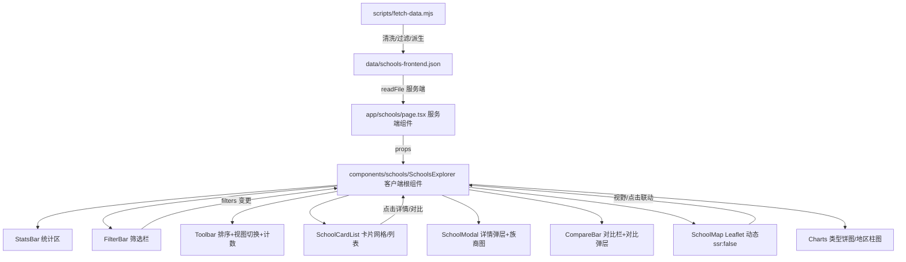

## 产品概述

参考 /Users/sun/Code/新西兰网站/schools.html，在本项目（/Users/sun/Code/NZ网站，Next.js + Tailwind + shadcn/ui）中完整复现中小学学校库页面，面向中国游学用户，界面中文、机构名保留英文原文。

## 核心功能

- 数据接入：改造 fetch-data 脚本，按参考 csv-to-json.py 规则过滤中小学数据（仅保留 Composite/Primary/Secondary/Intermediate/Contributing 等类型 + State/Private + Open + 有经纬度），并派生前端字段（name/city/type/level/authorityCN/coedCN/eqi/isolation/roll/lat/lng/url/ethnic/boarding/urban/language），生成 data/schools-frontend.json（预计约 2465 所）。
- 顶部统计区：学校总数、公立数、私立数、平均 EQI。
- 筛选栏：类型、学段、地区（城市）、公私立、城乡、寄宿、教学语言、关键词搜索。
- 排序：名称、EQI 升序、在校人数降序、地区。
- 视图切换：卡片网格 / 横向列表。
- 学校卡片列表：名称、类型/学段标签、地区、EQI、在校人数、公私立标签、详情按钮、加入对比勾选。
- 详情弹层：完整字段 + 族裔分布条形图（欧洲裔/毛利裔/太平洋岛裔/亚裔/MELAA/其他，百分比进度条）。
- 对比栏：最多 3 所学校，对比摘要条 + 对比弹层（多卡并排）。
- 地图：Leaflet + OpenStreetMap 免费瓦片，标记按学段着色，与筛选/列表联动（悬停高亮、点击居中、视野裁剪）。
- 图表：学校类型分布饼图、地区分布柱图（Chart.js）。
- 清空筛选、结果计数、空状态。

## 技术栈

- Next.js 14.2.33（App Router）+ TypeScript
- Tailwind CSS 3.4 + shadcn/ui（保留现有 teal 主题与毛玻璃导航）
- 新增依赖：leaflet（地图）、chart.js（图表）
- 部署：EdgeOne Makers

## 实现方案

### 总体策略

采用「服务端预取数据 + 客户端交互组件」架构。服务端组件 `app/schools/page.tsx` 读取 `data/schools-frontend.json` 并传给客户端根组件 `SchoolsExplorer`（'use client'），所有筛选、排序、地图、弹层、对比、图表均在客户端完成，避免运行时请求政府 API，也不把 4MB 原始文件打进 bundle。

### 关键技术决策

1. **前端数据文件独立生成**：在 `scripts/fetch-data.mjs` 中新增中小学清洗步骤，沿用参考 `csv-to-json.py` 的过滤与派生规则，输出 `data/schools-frontend.json`（过滤后，约 2465 条，体积小、字段规整）。原始 `data/schools.json` 保留供后续其他用途。这样前端无需在浏览器内做字段映射与过滤，性能更优，且逻辑与参考一致、可验证。
2. **字段映射适配**：本项目 CKAN 字段为详细值（如 `Full Primary`、`Secondary (Year 9-15)`、`State : Integrated`、`EQi_Index`、`Isolation_Index`、`Total`、`Language_of_Instruction`、`BoardingFacilities`、`CoEd_Status`、`URL`、`Add1_City/Add1_Suburb`、`Territorial_Authority`、`Education_Region`、族裔 `European/Māori/Pacific/Asian/MELAA/Other/International`）。过滤用 `Org_Type.includes('Primary'|'Secondary'|'Composite'|'Intermediate'|'Contributing')` 仍适用（'Full Primary'⊃'Primary'）。level 派生：contains 'Composite'→贯通制，'Intermediate'→初中，'Contributing'/'Primary'→小学，'Secondary'→中学。`coedCN` 由 `CoEd_Status` 映射。
3. **Leaflet 动态导入**：`SchoolMap` 用 `next/dynamic` 且 `ssr:false`，并在组件内 `import 'leaflet/dist/leaflet.css'`，避免 SSR 报错与水合不匹配。标记着色按 level 分四色，弹窗与列表/卡片联动使用事件委托。
4. **Chart.js 客户端渲染**：类型饼图与地区柱图在客户端组件用 `chart.js/auto` 初始化，组件卸载时 `destroy()`，避免内存泄漏。
5. **状态管理**：单文件 `SchoolsExplorer` 内用 `useState/useMemo` 维护 filters/sort/view/compare/modal，不引入额外状态库（本期规模足够）。筛选结果为 `useMemo` 派生，性能可控（2465 条，单次过滤 < 5ms）。
6. **样式落地**：主体用 Tailwind 类还原参考 schools.css 的布局与层次；地图容器、族裔进度条、弹层动画、卡片悬停等需精细控制的保留在 `globals.css`（或新建 `app/schools/schools.css`）补充，并融入本项目 teal + Glassmorphism 规范（半透明卡片、柔和阴影、圆角）。

### 性能与可靠性

- 过滤/排序为纯前端内存运算，O(n) 遍历 2465 条，开销极小；用 `useMemo` 缓存避免重复计算。
- 地图标记：参考的 CLUSTER_THRESHOLD=200 阈值——≤200 用普通图层不聚合，>200 用 markerCluster（需引入 leaflet.markercluster 及 CSS，或用简单分片）。本期先用普通图层 + 仅在可视范围渲染标记（按筛选结果渲染全部 marker，地图本身可承载 2465 个 DOM marker，但为稳妥引入 leaflet.markercluster）。
- 弹层/对比以事件委托绑定一次，避免列表重渲染重复绑定。
- 数据生成失败不影响已落盘文件；前端读取失败时显示空状态提示。

### 实现注意事项

- 沿用现有 `components.json`、`lib/utils.ts`（cn）、`components/ui/*`，不改动既有导航/页脚。
- 机构名显示 `Org_Name` 原文，UI 文案中文，禁用占位符。
- `package.json` 增加 `leaflet`、`leaflet.markercluster`、`chart.js` 依赖与 `@types/leaflet` 开发依赖。
- `.gitignore` 已忽略 `/data`，`schools-frontend.json` 由 `npm run fetch:data` 生成，需在 README/文档注明构建前先拉取。
- 升级依赖后需重新 `npm install` 并 `npm run build` 验证。

## 架构设计



## 目录结构

```
/Users/sun/Code/NZ网站/
├── scripts/
│   └── fetch-data.mjs          # [MODIFY] 新增中小学清洗：过滤+派生字段，输出 data/schools-frontend.json
├── package.json                # [MODIFY] 增加 leaflet / leaflet.markercluster / chart.js / @types/leaflet 依赖
├── app/
│   ├── schools/
│   │   ├── page.tsx            # [MODIFY] 改为服务端读取 schools-frontend.json，传给 SchoolsExplorer
│   │   └── schools.css         # [NEW] 补充地图/族裔条/弹层/卡片等自定义样式（teal glassmorphism）
│   └── globals.css             # [MODIFY] 补充地图容器、弹层、对比条等必要全局类（或可只放 schools.css）
├── lib/
│   ├── institutions.ts         # [MODIFY] 新增 getSchoolFrontendList() 读取 schools-frontend.json，新增 SchoolFrontend 类型
│   └── school-filters.ts       # [NEW] 筛选/排序/派生工具函数与常量（TYPE_GROUPS/AUTHORITY_CN/level 映射等），供组件复用
└── components/
    └── schools/
        ├── SchoolsExplorer.tsx # [NEW] 客户端根组件：状态编排、过滤结果 useMemo、组合各子组件
        ├── StatsBar.tsx        # [NEW] 顶部统计（总数/公立/私立/平均EQI）
        ├── FilterBar.tsx       # [NEW] 筛选栏（类型/学段/地区/公私立/城乡/寄宿/语言/搜索），含清除
        ├── Toolbar.tsx         # [NEW] 排序选择 + 网格/列表视图切换 + 结果计数
        ├── SchoolCard.tsx      # [NEW] 单卡片（网格/列表两态），详情按钮+对比勾选
        ├── SchoolCardList.tsx  # [NEW] 卡片列表容器，空状态
        ├── SchoolModal.tsx     # [NEW] 详情弹层，含 EthnicBar 族裔分布图
        ├── EthnicBar.tsx       # [NEW] 族裔占比进度条（CSS）
        ├── CompareBar.tsx      # [NEW] 对比摘要条 + 对比弹层（多卡并排）
        ├── SchoolMap.tsx       # [NEW] Leaflet 地图（dynamic ssr:false），标记着色+弹窗+联动
        └── Charts.tsx          # [NEW] 类型分布饼图 + 地区分布柱图（Chart.js）
```

## 关键代码结构（可选）

```ts
// lib/institutions.ts 新增
export interface SchoolFrontend {
  id: string;
  name: string;
  type: string;
  level: "小学" | "初中" | "中学" | "贯通制" | "其他";
  authority: string;
  authorityCN: string;
  coedCN: string;
  city: string;
  suburb: string;
  territorial: string;
  region: string;
  urban: string;
  boarding: "Yes" | "No";
  language: string;
  roll: number;
  eqi: number | string;
  isolation: number | string;
  lat: number;
  lng: number;
  url: string;
  european: number; maori: number; pacific: number;
  asian: number; melaa: number; other: number; international: number;
}
export async function getSchoolFrontendList(): Promise<SchoolFrontend[]>;
```

## 设计风格

完整复现参考中小学学校库页面，融入本项目「新西兰自然风 + Glassmorphism 轻玻璃 + teal 主色」设计规范。整体清新、premium、响应式（桌面优先，移动端堆叠）。

## 页面分区（落地页之外的中小学页）

1. 顶部统计区：半透明毛玻璃卡片，展示学校总数、公立数、私立数、平均 EQI，数字大号加粗、teal 强调色。
2. 图表区：类型分布饼图 + 地区分布柱图（Chart.js），玻璃卡片容器，柔和阴影。
3. 筛选栏：白底圆角卡片，4 列网格；标签 + 多选下拉/复选；含搜索框、类型树、公私立、城乡、寄宿、语言、EQI/偏远度分档（保留参考的 help-tip 悬停说明）。
4. 工具栏：左侧结果计数（共 X 所 / 显示 Y），右侧排序下拉 + 网格/列表视图切换。
5. 结果区：左列表（卡片网格/横向列表，hover teal 描边+微抬升）右地图（Leaflet，分屏 grid；移动端地图置底或折叠）。地图标记按学段四色（小学蓝/初中红/中学紫/贯通制棕），含图例与街道/卫星切换。
6. 详情弹层：居中卡片，头部 teal 渐变品牌区（校名+地址），主体两列字段网格 + 族裔分布条形图，底部操作（访问官网/ERO 报告/分享）。
7. 对比栏：底部 sticky 毛玻璃条，展示已选学校 chips + 查看对比按钮，弹层多卡并排。

## 交互细节

- 卡片 hover：teal 边框 + 浅 teal 底 + 微阴影，列表联动地图 marker 描边高亮。
- 筛选/排序：即时客户端过滤，无加载等待。
- 地图：平移/缩放结束按视野裁剪列表（参考 followMap 逻辑），点击 marker 居中并弹窗。
- 弹层/对比：淡入动画，点击遮罩关闭，body 滚动锁定。
- 微动效：fade-up 入场、hover 抬升、按钮过渡，符合 design_guidelines。

## Agent Extensions

### Skill

- **ui-ux-pro-max**
- 用途：为中小学学校库页面的视觉与交互设计提供指引，确保筛选栏、卡片、弹层、地图、图表整体 premium、响应式、符合本项目 teal glassmorphism 规范。
- 预期结果：产出落地的中小学页布局、配色、组件规格与微动效方案，并体现在 SchoolsExplorer 及子组件实现中。