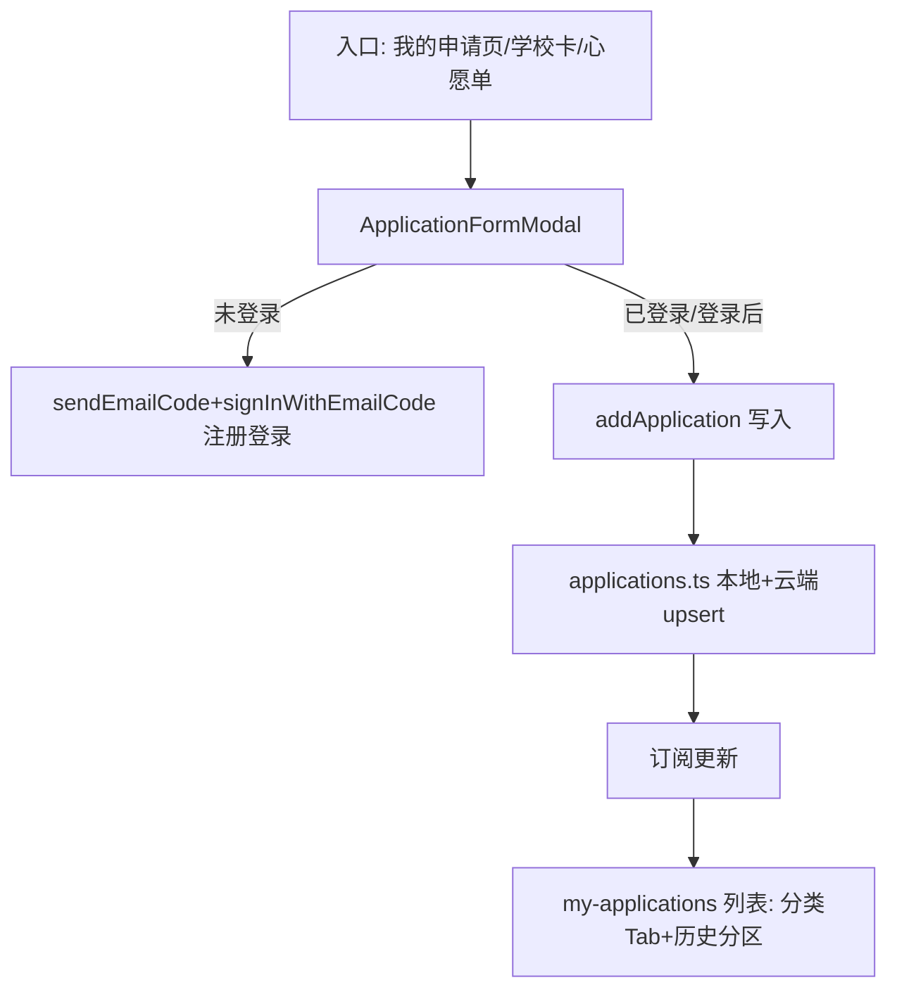

## 用户需求概述

将「我的申请」从简单状态列表升级为**收集制式申请信息**的完整功能，区分中小学 / 幼儿园两套申请。本期聚焦中小学完整表单，幼儿园分类与入口占位（表单内容待幼儿园学校库理清后再做）。用户可在分类下新增申请、管理申请（查看每条申请与系统状态）、查看历史申请。

## 核心功能

- **分类入口**：「我的申请」页面顶部按 中小学 / 幼儿园 / 全部 切换；幼儿园本期占位（无表单，提示「即将上线」）。
- **新增申请表单（中小学）**，字段：
- 邮箱：已登录自动预填且只读；未登录留空，提交时校验并顺带完成邮箱验证码注册/登录。
- 出生日期：日期选择器（年/月/日下拉，避免原生日历兼容问题）。
- 所在城市：省 + 市 两级联动下拉。
- 计划游学起止时间：**精确日期 / 模糊时段 两种模式可切换**。模糊模式用「年份 / 月份 / 上旬·中旬·下旬」三段下拉，起止各一套，组合为如「2026年10月中旬 — 2026年11月中旬」。
- 意向学校：支持自填文本 + 下拉提示（从学校库匹配）；支持「心愿单一键导入」预填多条。
- 需要的协助：多选（签证、住宿、接机、行程规划等）。
- 其他诉求：自由文本输入。
- **提交与状态**：提交后状态由系统驱动（统一为「待审核/已提交」），用户不可改。未登录提交时先发码+验码完成注册登录，再保存申请。
- **管理列表**：分类 Tab 下展示每条申请卡片（核心字段摘要 + 系统状态徽章）；可查看详情、移除；已结束（已录取/未通过）归入「历史」分区，与进行中分开。
- **入口联动**：学校详情卡「申请这所学校」、心愿单「一键申请」改为打开新增表单并预填意向学校（单校/批量心愿单）。
- **本期不含**客服/社群二维码入口；幼儿园表单内容留待后续。

## 视觉与交互

沿用现有湖水蓝绿设计令牌（primary/stroke/ink/glass/chip/圆角/动画），页面与弹窗风格一致；表单弹窗为玻璃拟态卡片，字段分组清晰，必填项校验与错误提示、提交 loading 态。

## 技术栈

- 前端：Next.js（App Router）+ TypeScript + Tailwind（与现有项目一致）。
- 状态/持久化：复用现有「模块级 pub/sub + localStorage + 云端 PostgREST（`user_collections.applications` jsonb）」模式。
- UI 组件：沿用 lucide-react 图标与现有 `glass`/`.chip` 令牌，不引入新组件库。

## 实现方案

### 关键决策

1. **数据模型扩展**：在 `applications.ts` 中将 `ApplicationItem` 扩展为制式结构（保留 `status` 由系统驱动，新增 `category`、`form` 子对象承载全部字段；`intendedSchools` 为数组支持多校 + 心愿单导入）。幼儿园 `category:"ece"` 仅占位，`form` 可为空。
2. **时间模型**：`StudyPeriod { mode: "exact" | "fuzzy"; start: ExactDate|null; end: ExactDate|null; fuzzyStart: {year,month,tense}|null; fuzzyEnd: {...}|null }`，统一序列化为可展示字符串（如「2026年10月中旬 — 11月中旬」），兼容现有云端 jsonb。
3. **表单与列表分离**：新增「申请表单弹窗」组件（`application-form.tsx`），独立于列表页，可复用入口（页面新增、学校卡、心愿单）。表单本地校验 → 未登录走 `sendEmailCode`+`signInWithEmailCode` → 保存 `addApplication`（含完整 form）。
4. **状态不可改**：列表卡片仅展示 `STATUS_META` 徽章，移除「状态下拉」；状态枚举收敛为 `submitted(待审核)/reviewing(审核中)/accepted(已录取)/rejected(未通过)` 由系统驱动；详情只读。
5. **省市数据**：内置精简中国省份→主要城市映射常量（置于 `lib/regions.ts`），避免外部请求；下拉两级联动。
6. **历史分区**：列表按 `isClosed = accepted|rejected` 分为「进行中」「历史」两组展示，沿用现有统计。

### 性能与可靠性

- 表单校验纯前端，无额外请求；提交仅 1 次云端 upsert（沿用 `saveCloudApplications`，`merge-duplicates` 不影响 favorites/compare 列）。
- 未登录注册登录复用现有 `auth.ts` 邮箱验证码流程，失败降级提示，不破坏现有匿名兜底。
- 省市/学校下拉使用受控组件 + 本地常量，避免重渲染与额外遍历；学校匹配用 `useMemo` 过滤。
- 列表 `mounted` 守卫保留，避免水合不一致。

### 实现注意事项

- 不改动现有 `favorites`/`compare` 同步路径；`applications` 列云端写入独立，迁移未执行时自动降级 localStorage。
- 复用 `useAuthUser` 预填邮箱并禁用输入；未登录提交时先发码+验码完成注册/登录，再保存。
- 学校意向下拉的数据源复用 `schools-store`（`getSchoolsSnapshot`/`subscribeSchools`）取 `name/suburb/city`，模糊匹配。
- 现有 `SchoolModal`「申请这所学校」与 `favorites-popover`「一键申请」改为打开表单弹窗（传预填学校），不再直接 `addApplication`。

## 架构设计

数据流：入口（页面新增 / 学校卡 / 心愿单）→ `ApplicationFormModal`（校验+可选注册登录）→ `applications.ts addApplication`（localStorage + 云端 upsert）→ 发布订阅 → `my-applications` 列表页实时刷新。
登录桥接：`auth-init` 已接 `setApplicationsUser`，登录后云端覆盖本地，无需改动。



## 目录结构

```
src/
├── lib/
│   ├── applications.ts          # [MODIFY] 扩展 ApplicationItem 为制式结构（category/form/intendedSchools/studyPeriod/assists/notes），新增 addApplicationForm、useApplications 等；status 系统驱动
│   ├── regions.ts              # [NEW] 中国省份→城市两级联动常量 + 类型
│   └── user-data.ts            # [不改逻辑] applications 列云端读写已具备，仅确认字段兼容
├── components/
│   ├── auth/
│   │   └── user-menu.tsx       # [不改] 「我的申请」已跳 /my-applications
│   ├── applications/
│   │   ├── application-form.tsx      # [NEW] 中小学制式申请表单弹窗（含时间精确/模糊切换、省市联动、意向学校下拉+心愿单导入、协助多选、出生日期下拉、邮箱预填/注册）
│   │   └── application-card.tsx      # [NEW] 申请卡片（字段摘要+系统状态徽章+查看详情/移除），中小学/幼儿园通用
│   ├── schools/school-modal.tsx      # [MODIFY] 「申请这所学校」改为打开 ApplicationFormModal 并预填该校
│   └── favorites-popover.tsx         # [MODIFY] 「一键申请」改为批量打开 ApplicationFormModal（预填心愿单学校）
└── app/
    └── my-applications/
        └── page.tsx            # [MODIFY] 重构：分类Tab(中小学/幼儿园/全部)+新增入口+历史分区+空态引导；幼儿园占位
```

## 关键代码结构（节选）

```ts
// lib/applications.ts
export type ApplicationCategory = "school" | "ece";
export type ApplicationStatus = "submitted" | "reviewing" | "accepted" | "rejected";
export interface StudyPeriod {
  mode: "exact" | "fuzzy";
  start?: string | null;          // exact: YYYY-MM-DD
  end?: string | null;
  fuzzyStart?: { year: number; month: number; tense: "early" | "mid" | "late" } | null;
  fuzzyEnd?: { year: number; month: number; tense: "early" | "mid" | "late" } | null;
}
export interface IntendedSchool { id?: string; name: string; city?: string; }
export interface ApplicationItem {
  id: string;
  category: ApplicationCategory;
  status: ApplicationStatus;       // 系统驱动，用户不可改
  email: string;
  birthDate?: string;              // YYYY-MM-DD
  province?: string;
  city?: string;
  studyPeriod?: StudyPeriod;
  intendedSchools: IntendedSchool[];
  assists: string[];
  notes?: string;
  appliedAt: string;
  updatedAt: string;
}
```

## 设计风格

沿用项目既有「湖水蓝绿风（Lake Teal）」轻玻璃拟态风格，保证与全站顶栏、心愿单浮层视觉一致。表单弹窗与列表卡片采用圆角玻璃卡片、柔和绿色投影、状态色徽章。

## 页面布局（/my-applications）

- 顶部：标题「我的申请」+ 副标题；右侧「+ 新增申请」主按钮。
- 分类切换：中小学 / 幼儿园 / 全部 三段 Tab（玻璃底，选中态主色）。
- 列表区：进行中申请卡片网格；下方「历史申请」分区（已录取/未通过）。
- 空态：图标 + 引导文案 + 去学校库按钮。
- 幼儿园 Tab：占位卡「幼儿园申请即将上线」。

## 表单弹窗（ApplicationFormModal）

- 玻璃卡片居中弹层，顶部标题「中小学申请」+ 关闭。
- 分区：① 联系（邮箱只读/必填）② 学生信息（出生日期三段下拉）③ 所在城市（省+市联动）④ 游学时间（精确/模糊切换，模糊为年/月/旬下拉×2）⑤ 意向学校（自填+下拉提示，心愿单一键导入 chip）⑥ 需要的协助（多选 chip）⑦ 其他诉求（textarea）。
- 底部：提交按钮（loading 态）+ 取消；未登录时提交先走验证码步骤（复用现有 LoginModal 样式）。

## 交互细节

- 字段分组、必填星标、错误内联提示。
- 意向学校输入时出现下拉匹配学校名；心愿单导入以可删除 chip 展示。
- 状态徽章用现有 success/warning/error/info 令牌。
- 弹窗/卡片出现用 `animate-fade-up`，沿用现有动画令牌。

## Agent Extensions

### Skill

- **ui-ux-pro-max**
- Purpose: 设计「我的申请」页面与申请表单弹窗的信息架构、视觉风格与组件规范，确保与现有湖水蓝绿设计令牌一致。
- Expected outcome: 产出表单弹窗与列表页的布局/交互/微文案规范，指导实现阶段写出高质感 UI。

### MCP

- **CloudBase AI ToolKit**
- Purpose: 确认云端 `user_collections.applications` 列与 RLS 兼容；若迁移未执行，通过 `managePgDatabase` 应用 `20260823090000_add_applications.sql`，并验证云端读写。
- Expected outcome: 制式申请数据可安全持久化到云端并按 owner 隔离，未登录降级 localStorage。

### SubAgent

- **code-explorer**
- Purpose: 在实施前核查 `applications.ts`/`user-data.ts`/`auth.ts` 现有 API 签名与调用点，确认 `sendEmailCode`/`signInWithEmailCode`/`saveCloudApplications` 接口细节，避免方案与代码脱节。
- Expected outcome: 给出精确的现有函数签名与修改点清单，支撑计划落地。