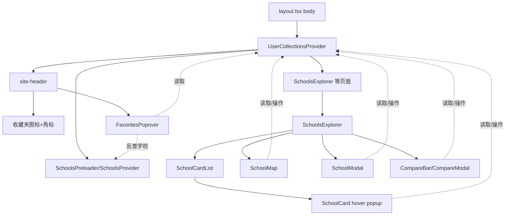

## 用户需求

1. 在网站右上角（全局 site-header）新增收藏夹入口：图标按钮 + 点击展开浮层列表，跨页面（/schools、/ece）均可见，展示用户收藏的学校。
2. 解决收藏与对比的多端同步问题：

- 对比：popup、学校卡片双向同步；
- 收藏：popup、学校卡片、收藏夹浮层三方同步。

## 产品概述

将收藏（favoriteIds）与对比（compareIds）状态从 `schools-explorer` 局部提升为全局 React Context，所有相关组件统一从 Context 读取，达成任意入口操作即时同步；同时在全局 header 增加收藏夹图标与浮层，使收藏夹跨页面常驻。保留现有的 localStorage 持久化策略，刷新/重开仍保留。

## 核心功能

- 全局收藏夹入口：右上角图标按钮带未读/数量角标，点击展开浮层，列出收藏学校（名称、地区、类型），可移除或清空，空态有引导文案。
- 全局状态同步：新建 Provider 包裹全站，收藏与对比状态集中管理；卡片、地图 popup、详情 modal、对比栏、收藏夹浮层任意一处变更，其余各处即时刷新。
- 持久化：收藏（wolly-favorites）与对比（wolly-compare，上限 4）继续写入 localStorage，跨会话保留。
- 跨页面：离开 /schools 进入 /ece 或首页，收藏夹与对比状态保持一致可见。

## 技术栈

- 框架：Next.js（App Router）+ React + TypeScript
- 样式：Tailwind CSS（现有 tokens：primary/secondary/ink/bg-soft/stroke）
- 状态：React Context + localStorage（沿用既有 `SchoolsProvider` 范式）
- 图标：lucide-react（现有依赖）

## 实现方案

采用「全局 Context Provider 提升状态 + 全局收藏夹浮层」策略，对齐现有 `SchoolsProvider`/`useSchools` 模式：

- 新建 `UserCollectionsProvider`，在 `layout.tsx` 的 body 顶层挂载（与 `SchoolsPreloader` 同级或在其内部），使 `/schools`、`/ece`、首页等所有页面共享同一状态实例。
- Provider 内部持有 `favoriteIds`、`compareIds` 两个 state，初始化时从 localStorage 读取（复用 `src/lib/favorites.ts` 与 `src/lib/schools-store.ts` 的读写逻辑，避免重复实现），提供 `toggleFavorite/toggleCompare/clearCompare/removeFavorite` 及派生 `inFavorites(id)`/`inCompare(id)`。
- 所有消费组件（`SchoolCard`、`SchoolMap`、`SchoolModal`、`CompareBar`、`CompareModal`、`SchoolCardList`、新增 `FavoritesPopover`）改为从 `useUserCollections()` 读取，移除 `schools-explorer` 中的 prop 透传与局部 state。
- 收藏夹浮层从 `schools-explorer` 抽出为独立组件 `FavoritesPopover`，由 `site-header` 渲染，从 Context 读取收藏 id，并通过 `useSchools()` 反查 `SchoolFrontend` 渲染列表（schools 数据已全局可用）。
- 性能：Context value 用 `useMemo` 稳定引用，避免无谓重渲；收藏/对比操作为 O(1) 数组更新，频率极低，无需额外缓存。地图 popup 仍用现有 `window.__schoolMapActions` 全局回调桥接（保持现状），但回调内部调用 Context 的 toggle，确保 popup 与卡片同源。
- 可靠性：Provider 读 localStorage 失败（隐私模式）静默降级为空数组；写入失败忽略，不阻塞 UI。

## 实现要点

- 复用 `src/lib/favorites.ts`（`readLocalStorage/writeLocalStorage` 思路）与 `src/lib/schools-store.ts`（`useCompare` 思路），不新建持久化文件，仅在 Provider 内组合调用，保持单一数据源。
- `schools-explorer` 删除 `favoriteIds`/`compareIds` 的 `useState` 与 `subscribeFavorites` 订阅，改为从 Context 取；其内部的 `FavPanel`/`showFav` 整体删除，浮层逻辑迁至 `site-header` + `FavoritesPopover`。
- `layout.tsx` 按顺序挂载：`UserCollectionsProvider` → `SchoolsPreloader`（内含 `SchoolsProvider`）。因 `FavoritesPopover` 依赖 `useSchools()`，Provider 必须包在 `SchoolsProvider` 外层或同一层级且 `site-header` 在 `SchoolsProvider` 内。建议：`layout` 中结构为 `UserCollectionsProvider > (SchoolsPreloader + SiteHeader + main + Footer)`，并在 `SchoolsPreloader` 内保留 `SchoolsProvider`（现状），`SiteHeader` 已在外层可直接用 `useUserCollections`；`FavoritesPopover` 内用 `useSchools` 取学校数据——需确保 `useSchools` 在 `SiteHeader` 渲染时已就绪（SchoolsPreloader 同步 set 过 snapshot 或异步加载，列表为空时浮层显示加载态即可）。

## 架构设计



## 目录结构

```
src/
├── lib/
│   ├── user-collections.tsx   # [NEW] UserCollectionsProvider + useUserCollections。集中管理 favoriteIds/compareIds，初始化读 localStorage（复用 favorites.ts/schools-store.ts 读写），提供 toggle/remove/clear 与 inFavorites/inCompare 派生；value 用 useMemo 稳定。
├── components/
│   ├── site-header.tsx        # [MODIFY] 右上角「登录」前插入收藏夹图标按钮（带数量角标），点击切换 FavoritesPopover 浮层；用 useUserCollections 读 favoriteIds。
│   ├── favorites-popover.tsx  # [NEW] 全局收藏夹浮层组件。用 useUserCollections 读收藏 id + useSchools 反查学校对象，渲染列表/移除/清空/空态；点击外部关闭。
│   ├── schools-preloader.tsx  # [MODIFY] 在其内部或外层确保 UserCollectionsProvider 挂载（若改 layout 则可不改动，视最终挂载点）。
│   └── schools/
│       ├── schools-explorer.tsx  # [MODIFY] 删除 favoriteIds/compareIds 局部 state、subscribeFavorites、FavPanel/showFav；改为从 useUserCollections 取 compareIds/favoriteIds 与 toggle；保留过滤/排序/分页与地图联动。
│       ├── school-card.tsx       # [MODIFY] 移除 inCompare/inFavorite/onToggleCompare/onToggleFavorite props，改为 useUserCollections 内部读取与操作（hover popup 内按钮同步）。
│       ├── school-card-list.tsx  # [MODIFY] 移除 compareIds/favoriteIds/onToggle* props 透传，仅渲染 SchoolCard。
│       ├── school-map.tsx        # [MODIFY] 移除 favoriteIds/compareIds/onToggle* props，内部用 useUserCollections；window.__schoolMapActions 的 favorite/compare 改调 Context toggle。
│       ├── school-modal.tsx      # [MODIFY] 移除 inCompare/onToggleCompare props，改为 useUserCollections；保留收藏按钮（若需求需要 modal 也能收藏则加 onToggleFavorite，否则仅对比）。
│       ├── compare-bar.tsx       # [MODIFY] 移除 compareIds/onToggleCompare props，改为 useUserCollections。
│       └── compare-modal.tsx     # [MODIFY] 移除 compareIds/onToggleCompare props，改为 useUserCollections。
└── app/
    └── layout.tsx              # [MODIFY] 在 body 顶层用 UserCollectionsProvider 包裹（与 SchoolsPreloader 同层），确保跨页面全局可用。
```

## 设计风格

采用与现有站点一致的清新薄荷绿（primary/secondary）品牌风，玻璃拟态顶栏 + 圆角卡片。收藏夹图标按钮置于右上角「登录」左侧，带柔和数量角标；点击展开右侧下拉浮层（260-300px 宽），内含收藏学校列表（每张小卡：校名 + 地区 + 学段 chip + 移除按钮），底部清空按钮；空态显示引导文案与图标。浮层使用 backdrop-blur 与轻阴影，入场 fade/scale 微动效，hover 高亮。

## 页面/组件规划

1. site-header 收藏入口区块：右上角收藏夹图标按钮（Heart/Star），未读数量角标，点击切换浮层。
2. FavoritesPopover 浮层：顶部标题「我的收藏（n）」+ 关闭；中部滚动列表（每张学校迷你卡，含移除）；底部「清空收藏」；空态插画 + 文案。
3. 学校卡片 hover popup：保持现有「对比/收藏」双按钮，视觉与全局同步（is-on 态）。
4. 地图 popup：保持现有收藏/对比按钮，操作后全局即时刷新。
5. 详情 modal：保留对比按钮，与全局同步。