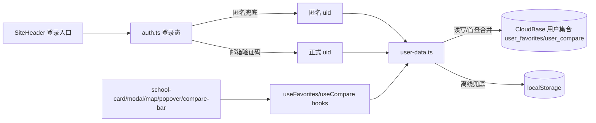

## 用户需求

在已与 CloudBase for Supabase（PostgreSQL）打通数据层的基础上，补齐登录能力并打通用户态，使心愿单/对比支持跨设备同步。

## 产品概述

本期完成"登录基建 + 心愿单上云"：启用 CloudBase Auth v2 邮箱验证码登录，进站自动匿名兜底，登录后把当前 localStorage 中的心愿单/对比合并同步到云端用户库；顶栏登录入口由禁用占位改为可用，展示用户态并提供登出。为后续"微信扫码登录"预留账号关联（linkWithWechat）升级口子。

## 核心功能

- 邮箱验证码登录/注册：输入邮箱→获取验证码→填码登录，首次即注册，免费、个人可测。
- 匿名进站兜底：未登录用户自动获得匿名身份，可正常浏览与收藏，无需强制注册。
- 心愿单/对比云端同步：登录后按 uid 归属读写用户集合；首次登录将本地 localStorage 心愿单合并上云，之后以云端为准，支持跨设备/换浏览器同步。
- 用户态与登出：顶栏展示登录状态（邮箱/头像），提供登出；未登录显示登录入口。
- 微信升级预留：auth 层预留 linkWithWechat 调用位与注释，本期不实现微信登录。

## 技术栈选型

- 前端框架：Next.js 16（App Router）+ React 19（现有，保持）
- 样式：Tailwind CSS v4（现有）
- 云开发 SDK：新增 `@cloudbase/js-sdk`（仅客户端），复用现有 `@cloudbase/node-sdk` 服务端网关逻辑
- 认证：CloudBase Auth v2 邮箱验证码登录 + 匿名登录（控制台开启对应方式）
- 用户数据存储：CloudBase 用户库集合（NoSQL 文档库 `user_favorites` / `user_compare`），按 `uid` 归属

## 实现方案

### 总体策略

在客户端初始化 `@cloudbase/js-sdk`，封装 `src/lib/auth.ts` 管理匿名兜底、邮箱登录、登出与登录态；新增 `src/lib/user-data.ts` 负责云端心愿单/对比的读写与"本地→云端"首登合并。现有 `favorites.ts` / `user-collections.ts` 的模块级 pub/sub 模式不变，仅把底层数据源在"已登录=云端、未登录=localStorage"之间切换，保证 school-card / school-modal / school-map / favorites-popover / compare-bar 等组件无感接入。

### 关键技术决策

1. **邮箱验证码而非邮箱+密码**：注册转化更高、无需密码找回流程，且天然满足"首次即注册"。
2. **保留 localStorage 作为离线兜底**：未登录（匿名）状态继续用本地存储，避免破坏现有首屏 hydration（首帧为空、挂载后同步的真实模式已存在）。
3. **首登合并策略**：登录成功且云端为空时，把 localStorage 现有 favorites/compare 写入云端；之后以云端为准，避免重复与冲突。
4. **匿名兜底**：进站即 `signInAnonymously()`，保证未注册用户也能收藏；正式邮箱登录后通过 uid 关联，数据连续。
5. **预留微信关联**：`auth.ts` 预留 `linkWithWechat()` 调用位与注释，未来开启微信登录后接入即可，不改数据结构。

### 性能与可靠性

- 云端读取带内存缓存与 localStorage 镜像，避免每次操作打 SDK；写操作增量更新（按 uid 全量集合或数组替换）。
- 登录态通过 `onAuthStateChanged` 订阅，登录/登出时触发一次云端拉取与本地合并，不轮询。
- 失败降级：云端写入失败回退 localStorage 并提示，不影响浏览。

### 安全

- 用户集合安全规则限定 `auth.uid == owner`，匿名用户不可读写他人数据；仅登录用户可写自己的心愿单。
- 前端仅暴露 `NEXT_PUBLIC_CLOUDBASE_ENV_ID` 与 publishable key，绝不暴露 API_KEY/SECRET。

## 实现注意

- SDK 仅在 `"use client"` 组件/模块内初始化，禁止在 SSR 注入服务端密钥。
- 复用现有 hydration 安全写法（首帧空、useEffect 同步）。
- 不改动 PG 数据层（`pg.ts`/`data.ts`）与定时同步云函数，控制改动范围。
- 新增依赖需在构建前安装并校验版本兼容（Next 16 / React 19）。

## 架构设计



## 目录结构

```
package.json                         # [MODIFY] 新增 @cloudbase/js-sdk 依赖
.env.local / .env.example            # [MODIFY] 新增 NEXT_PUBLIC_CLOUDBASE_ENV_ID（前端可见环境ID）
src/lib/auth.ts                      # [NEW] 客户端 CloudBase 初始化、匿名兜底、邮箱登录/登出、登录态订阅、linkWithWechat 预留
src/lib/user-data.ts                 # [NEW] 云端心愿单/对比读写、首登本地合并、缓存与降级
src/lib/favorites.ts                 # [MODIFY] 登录后切换云端数据源，保留 localStorage 兜底，pub/sub 接口不变
src/lib/user-collections.ts          # [MODIFY] 同上，对比列表云端同步
src/components/site-header.tsx       # [MODIFY] 启用登录按钮，展示用户态与登出，接 auth.ts
src/components/auth/
  login-modal.tsx                    # [NEW] 邮箱验证码登录/注册弹窗（发码→填码→登录）
  user-menu.tsx                      # [NEW] 登录态下拉（邮箱/头像、登出、绑定提示）
cloudbase/migrations/
  xxxx_create_user_collections.sql   # [NEW] 用户库集合/安全规则说明（或采用 SDK 自动建集合）
```

## 关键代码结构

```ts
// src/lib/auth.ts 核心接口（客户端）
export interface AuthUser { uid: string; email: string | null; isAnonymous: boolean; }
export function initCloudBase(): void;
export function onUserChanged(cb: (u: AuthUser | null) => void): () => void;
export async function signInWithEmailCode(email: string, code: string): Promise<void>;
export async function sendEmailCode(email: string): Promise<void>;
export async function signOut(): Promise<void>;
// 预留：export async function linkWithWechat(): Promise<void>;
```

## Agent Extensions

### Skill

- **cloudbase**
- 用途：指导 CloudBase Auth v2 邮箱登录、匿名登录、用户集合安全规则与 JS SDK 客户端集成，以及环境配置前置检查。
- 预期结果：按 CloudBase 官方最佳实践完成登录基建与用户数据上云，避免 SDK/安全规则误用。

### MCP

- **CloudBase AI ToolKit**
- 用途：查询环境信息、检查/开启邮箱与匿名登录方式、配置 publishable key、创建用户集合与安全规则、添加安全域名（本地 dev origin）。
- 预期结果：登录方式已开启、前端可初始化、用户集合仅本人可访问、本地开发 origin 已加入白名单。